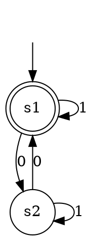

# Минимизатор ДКА

Однооконное приложение PyQt6 для загрузки и обработки детерминированных конечных автоматов. Алгоритм минимизации подключается через отдельный Python-класс.

> `PTDFAMinimizer` в `pt_dfa_minimizer.py` реализует минимизацию PT-DFA по алгоритму уточнения разбиения из статьи Valmari-Lehtinen. Старое имя `PassthroughMinimizer` сохранено только как совместимый алиас.

Результат является самостоятельным ДКА с состояниями `C0`, `C1`, … . Во
вкладках интерфейса отдельно доступны графы, таблица переходов и состав
классов эквивалентности.

## Форматы входных файлов

Поддерживаются `.txt`, `.csv`, `.xlsx`, `.dot` и `.gv`.

### TXT, CSV и XLSX

Первая строка содержит пять заголовков:

```text
states;alphabet;transitions;initial;finals
```

В TXT/CSV колонки разделяются `;`. В Excel каждое значение находится в отдельной ячейке. Списки разделяются `|`, переход имеет вид `исходное_состояние,символ->целевое_состояние`. Функция переходов может быть частичной.

```text
q0|q1;0|1;q0,0->q0|q0,1->q1|q1,0->q0|q1,1->q1;q0;q1
```

Файлы TXT/CSV должны быть в UTF-8. Некорректные строки пропускаются и отображаются в списке ошибок.

### Graphviz DOT

Один DOT-файл описывает один ДКА в ориентированном графе `digraph`:

- фиктивная начальная вершина имеет `shape="none"` и одно ребро без `label` к начальному состоянию;
- принимающие состояния имеют `shape="doublecircle"`;
- переходы задаются рёбрами с непустым атрибутом `label`;
- идентификаторы вершин используются как имена состояний.



Парсер проверяет единственность начального состояния и детерминированность.
Функция переходов может быть частичной. DOT-файлы должны быть в UTF-8.

## Сохранение результата

Кнопка «Сохранить результат» экспортирует выбранный минимизированный ДКА:

- в CSV, который можно повторно открыть в приложении;
- в Graphviz DOT;
- в дополнительный файл `<имя>.classes.csv`, содержащий состав классов и
  список отброшенных состояний.

Исходный автомат в экспорт не включается.

## Разработка

```powershell
python -m venv .venv
.venv\Scripts\python -m pip install -e ".[dev]"
run app
run test
```

После установки проекта и активации `.venv` команды работают без префикса `.\` в PowerShell и `cmd.exe`.

Нативный PyQt-интерфейс тестируется через `pytest-qt`.

## Сборка EXE

```powershell
run build
```

Готовый файл: `release\DFA-Minimizer.exe`. Это сборка одним файлом без консольного окна.
